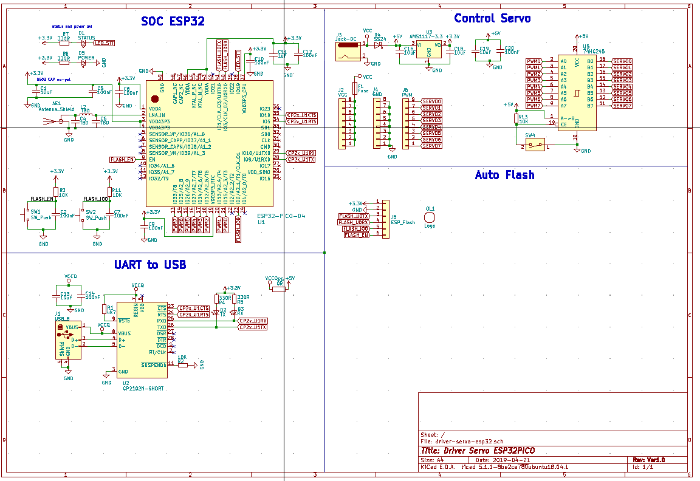
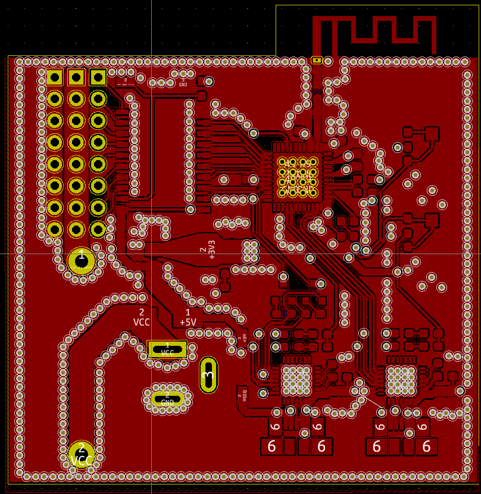
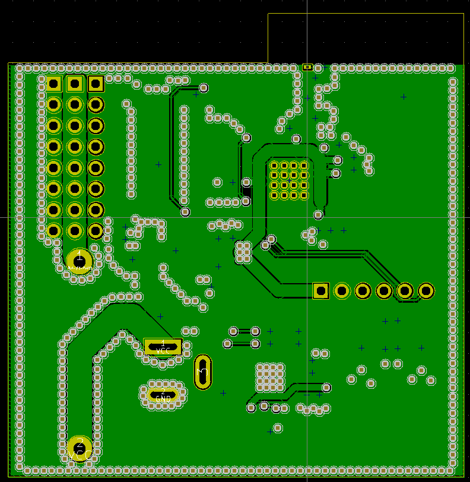
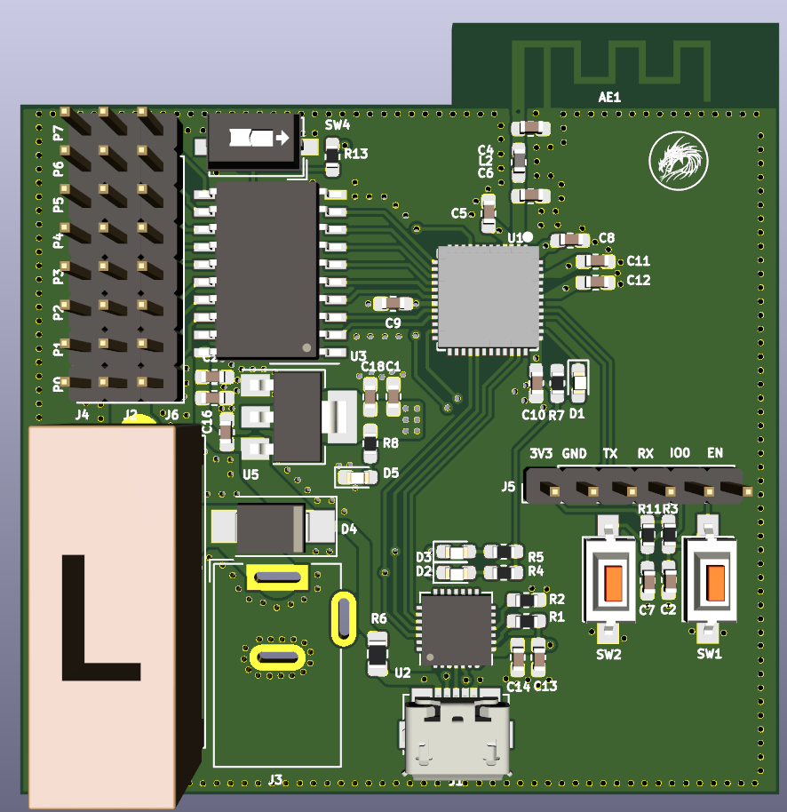
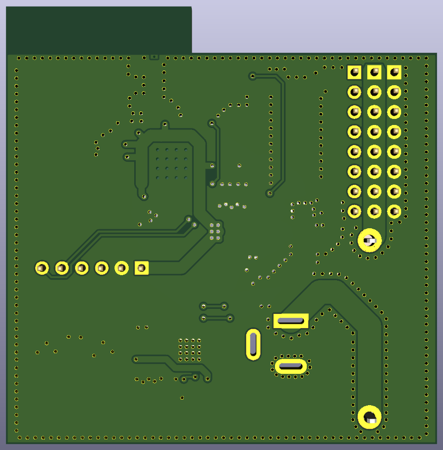

# Driver-servo-esp32-curcuit
thesis's hardware

## Hardware

### Schematics

### PCB Layout

#### Top side

#### Back side

### 3D

#### Top side

#### Back side

### Gerber

Version 1.0

- [Gerber V1.0](./assets/DS-ESP32-ver1.0.zip)

### Remark

This project was in development phase - we will remove this remark after release

# License
